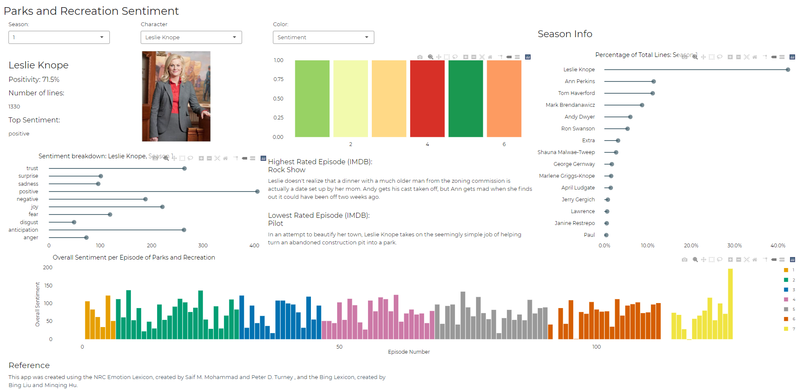

```{r setup, include=FALSE}
library(knitr)
knitr::opts_chunk$set(collapse = TRUE)
```

Recently, I stumbled upon a data set containing every line of dialogue over the entire run of the NBC Sitcom *Parks and Recreation*. As a huge fan of the show, text analytics, and R Shiny, I knew I had to make a project out of it. If you have not already, please check out the completed version of the app [here](https://wmouer.shinyapps.io/ParksSentiment/). I know the layout and display could be wonky on some screens, so hopefully things render okay. Below is a screenshot of what the app *should* look like. 


## Overview

This project consisted of three main phases. The first phase consisted of data wrangling and transformation. In the second phase, the app components and visuals were developed separately, and defined in such a way that would allow for dynamic filtering when used in the app. Finally, the components were put together and organized into a Shiny app. This process in reality was highly iterative, and consisted of several failures and scrapped ideas. In this write-up the process will be straightforward and an instant success. 

## Data Wrangling

The data wrangling in this project took two forms: the first was the dialogue data from the show, and the second was data scraped from the IMDB web page to provide further context. 

### Dialogue Data

The main data for this project was found on [Kaggle](https://www.kaggle.com/heheheluke/parks-and-recreation-scripts), and consisted of individual `*.csv` files for the lines in each episode. 
```{r libs, echo=T, error = F, warning=F, message=F}
library(tidyverse)
library(textdata)
library(tidytext)
library(stringr)
library(plotly)
library(rvest)

episode1 <- read_csv('scripts/s1e01.csv')
```
```{r prev}
head(episode1) %>% kable()
```
Thankfully, the naming of the 122 `*.csv` files was straightforward, for example `s1e01.csv`. This made it simple to loop through the folder of data files to build one data frame. 

```{r dataloop, message=F}
seasons = 1:7
episodes = c(6,24, 16, 22,22,20,12)
all_eps = data.frame()
overall_ep = 0

for(sn in seasons){
  for(ep in 1:episodes[sn]){
    eps = paste(ep)
    if(ep < 10) eps = paste('0', ep, sep = '')
    df <- read_csv(paste('scripts/s', sn, 'e', eps, '.csv', sep = ''))
    overall_ep = overall_ep + 1
    all_eps = rbind(all_eps, cbind(df, 'Season' = sn, 'Episode' = ep, 'Overall_Episode' = overall_ep))
  }
}
```
At this point, we have a data frame like the one above, but for all episodes. This data frame also contains `Season`, `Episode`, and `Overall_Episode`. Here's a look at the start of Season 3. 
```{r dataprev}
all_eps %>% filter(Season == 2) %>% head() %>% kable()
```
After this step, I had to make some manual adjustments to the data. In Season 6, the season opener and the season finale were both two part episodes. In the data sets, they are treated as single episodes, but we want to consider them split apart. This would keep episode length generally standardized and make it match the representation on IMDB. To do this, I found the lines that showed the episode breaks and then manually adjusted the episode number numbers for the following episodes. 

```{r episode_adjustment}
s6e1break = 48735
s6e21break = 58963
s7break = 59365
end_line = 65942
  
all_eps[s6e1break:end_line,5] = all_eps[s6e1break:end_line,5] + 1 #change overall episode numbers
all_eps[s6e21break:end_line, 5] = all_eps[s6e21break:end_line, 5] + 1

all_eps[s6e1break:s7break,4] = all_eps[s6e1break:s7break,4] + 1 #change episode numbers in season 6
all_eps[s6e21break:s7break,4] = all_eps[s6e21break:s7break,4] + 1

episodes = c(6,24, 16, 22,22,22,12)

all_eps %>% group_by(Season) %>% summarise(num_episodes = n_distinct(Episode)) %>% kable()
```

The next step was to break apart the lines into the individual words, remove punctuation and convert the data frame to a more "tidy" format. This was done using `tidytext::unnest_tokens()`. 
```{r all_eps_tidy}
all_eps_tidy <- all_eps %>% 
  group_by(Season, Episode) %>% 
  mutate(line_num = row_number()) %>% 
  ungroup() %>% 
  unnest_tokens(word, Line)
```
At this point, we have two data frames: `all_eps` and `all_eps_tidy`. The data frame `all_eps` will have more to do with the number of lines each character has, while `all_eps_tidy` will be more useful for determining sentiment. 

### IMDB Data

Shifting gears slightly, I also wanted to incorporate some data from IMDB to go alongside the dialogue data and sentiment scoring. The most straightforward way of doing this was to scrape the IMDB website to pull out episode ratings, titles, and descriptions. On the IMDB website, the *Parks and Recreation* has a page that shows these three pieces of information for all episodes of a given season. Moreover, the season selection is simple to do by adjusting the url. These pieces of organization reduced the challenges of this task considerably. 

After some experimentation, I was able to isolate the tags within the web page that contained the desired information. My understanding of web development terms and technologies is very shaky, so my terminology might be somewhat off. Lets have a look at what happens when we pull information for Season 1, Episode 1. 
```{r imdb_page}
page = read_html('https://www.imdb.com/title/tt1266020/episodes?season=1')
text = html_text(html_nodes(page, '.info'))
text[1]
```

Certainly looks like a disaster, but all the info we are looking for is in that data. If we trim the new lines and double spaces, it is much easier to read. 

```{r imdb_trim}
text <- gsub('\n', '', text)
text <- gsub('  ', '', text)
text[1]
```

Now, we can pick up on patterns and pull out information we want. The easiest is the description: for each episode the description follows the piece of text that says `'please try again. '`. The title and score are followed by an open parenthesis `(`, with the score occupying the last three characters of that section. Finally, the episode title follows the year of release, which takes the form `20XX`. Here's what this looks like for the first episode. 

```{r title_score_desc}
descriptions <- word(text, 2, sep = fixed('please try again.'))
ttl <- word(text, 1, sep = fixed('('))
scores <- as.numeric(str_sub(ttl, -3,-1))
titles <- word(ttl, 2, sep = '20\\d\\d') %>% str_sub(1,-4)
titles[1]
scores[1]
descriptions[1]
``` 

Thankfully, each of those patterns remain consistent for each episode of each season, so these lines of code can be used to loop through the entire series of the show. 

```{r imdb_loop}
imdb_df = data.frame()

for(sn in seasons){
  page <- read_html(paste('https://www.imdb.com/title/tt1266020/episodes?season=', sn, sep = ''))
  nodes = html_nodes(page, '.info')
  text = html_text(nodes)
  text <- gsub('\n', '', text)
  text <- gsub('  ', '', text)
  descriptions <- word(text, 2, sep = fixed('please try again.'))
  ttl <- word(text, 1, sep = fixed('('))
  scores <- as.numeric(str_sub(ttl, -3,-1))
  titles <- word(ttl, 2, sep = '20\\d\\d') %>% str_sub(1,-4)
  df <- data.frame('Season' = rep(sn, episodes[sn]), 'Episode' = 1:episodes[sn], 'Title' = titles, 'imdb_score' = scores, 'description' = descriptions)
  imdb_df = rbind(imdb_df, df)
}
head(imdb_df) %>% kable()
```

Finally, we can join the IMDB data with the dialogue data to create our final data set. In this step, we also pull in the Bing Lexicon for sentiment analysis, to gauge the overall sentiment of each episode. 

```{r}
episode_data <- all_eps_tidy %>% 
  inner_join(get_sentiments('bing')) %>% 
  count(Season, Episode, Overall_Episode, sentiment) %>% 
  pivot_wider(names_from = sentiment, values_from = n) %>% 
  mutate(sentiment = positive - negative)  %>% 
  inner_join(imdb_df, by = c('Season', 'Episode')) 
```

When I looked through the data frame, I noticed one small bug from the next-to-last section of code: season 7, episode 1 was missing its title. The score and description were there, but the title was a blank string. When I looked up the title of that episode, I found that it was *2017*. This meant that the code meant to trim away the episode release date had trimmed away the title as well. Since it was only a problem for one data point, I just corrected it manually. 
```{r}
episode_data$Title[113] = '2017' #This got lost in the string value trimming due to confusion with date
```

## Visualization

At this point, the heavy lifting of data manipulation was mostly done. The next steps were to come up with elements to show and how to show them. In this write-up, I will mostly focus on static graphs for a selected character. Showing options for a selected character/season. In the app itself, these graphs are dynamic and you can switch between characters and seasons to compare. 

### Who had the most lines?

Those who watched the show would not need a graph to answer this one. It's Leslie Knope. Nonetheless, I wanted to see how the breakdown of the show's top speakers changed from season to season. For each of the graphs made, I wrapped them in functions with parameters to use for filtering (this was mostly to make things easier when calling them in the Shiny `server`). 

```{r, fig.height=4, out.width= '100%'}
line_share_lollipop <- function(season){
  all_eps %>% 
    filter(Season == season) %>% 
    group_by(Character) %>%
    summarise(line_count = n()) %>%
    ungroup() %>% 
    mutate(lineshare = line_count / sum(line_count)) %>% 
    arrange(desc(lineshare)) %>% 
    mutate(Character = factor(Character, levels = Character[order(lineshare)])) %>% 
    head(15) %>% 
    ggplot(aes(x = Character, y = lineshare)) +
    geom_segment(aes(x = Character, xend = Character, y = 0, yend = lineshare), color ="#264653") + 
    geom_point(color = "#264653", size = 3, alpha = .6)+
    scale_y_continuous(labels = scales::percent)+
    coord_flip() + 
    labs(
      title = paste('Percentage of Total Lines: Season', season),
         x = '',
         y = '') + theme_minimal()
  #ggplotly() 
}

line_share_lollipop(3)

```

So, in season 3, Leslie Knope had a whopping 25% of the lines spoken in the show, over twice the amount of the next-highest character. 

### Sentiment: Full Series Run

Next, I simply visualized the overall sentiment (calculated using the Bing Lexicon) of each episode over the entire run of the series. There were some interesting trends:

```{r full_bar, fig.height=4,  out.width= '100%'}
full_series_bar <- function(){
  episode_data %>% 
    mutate(Season = as.factor(Season)) %>% 
    ggplot(aes(fill = Season, label = Episode, x = Overall_Episode,  text = Title, y = sentiment )) + 
    geom_col(show.legend = F) + 
    labs(title = 'Overall Sentiment per Episode of Parks and Recreation',
         x = 'Episode Number', 
         y = 'Overall Sentiment')+
    theme_minimal()
  ggplotly(tooltip = c('text', 'fill', 'label', 'y'))
}
full_series_bar()
```


Looking at this graph, I found it interesting how almost every season showed similar patterns in regards to the sentiment. Each of them started out relatively high in the first or second episode of the season. Then a few episodes in, there tended to be steep declines, as the overarching challenges of the season presented themselves. Then sentiment tended to surge in the middle of the season, followed by a second decline late in the season, before picking up as each season comes to a close. Although it doesn't fit perfectly for every season, it is interesting to see patterns in the storytelling. 

### Season IMDB Scores

Next, I wanted to use color to represent trends within a season. This would give another representation to the graph shown above. In this graph, the user can select whether to visualize sentiment of the episodes or IMDB score. 

```{r episode_bars, out.width='100%'}
g <- episode_data %>% 
    filter(Season == 3) %>% 
    ggplot(aes(label = Title, x = Episode, y =1 ,fill = imdb_score,  text = description))+ 
    geom_col(show.legend = F) +
    scale_fill_distiller(palette = 'RdYlGn', direction = 0)+
    labs(title = '', x = '', y = '') + 
  theme_minimal()

ggplotly(g,tooltip = c( 'label','x',  'fill'))

```

### Character Sentiment

For the final graph, I used a similar "lollipop" graph to represent each character's expression of various emotions for a given season. This measurement of emotion comes from the NRC Lexicon. Here are Chris Traeger's emotions from Season 3:

```{r sent_lollipop, height = 4, out.width='100%'}
all_eps_tidy %>% 
    filter(Season == 3, 
           Character == 'Chris Traeger') %>% 
    inner_join(get_sentiments('nrc')) %>% 
    count(sentiment) %>% 
    ggplot(aes(x = sentiment, y = n)) +
    geom_segment(aes(x = sentiment, xend = sentiment, y = 0, yend = n), color = "#264653") + 
    geom_point(color = "#264653", size = 3, alpha = .6)+
    scale_y_continuous()+
    coord_flip() + 
    labs(title =  'Sentiment breakdown: Chris Traeger, Season 3', 
         x = '',
         y = '') + 
    theme_minimal()
```

This is an area I might flesh out and adjust if I were to continue working on this app. I found that the distributions did not vary dramatically from character to character or from season to season. To correct for that, I might consider some kind of normalization for these values, so that one's expression of a given emotion is displayed *relative* to her peers. This would better highlight differences between characters rather than similarities based on the overall tone of the show. I might also consider using higher order *n*-grams to measure sentiment, rather than sticking to simple unigrams. 


## Shiny App

In this write up, I won't get too deep into the process of constructing the Shiny app, but I will share a couple of the resources that made the styling look nice without too much manual coding of the visual elements. The main elements that I have not mentioned above consisted of text and number values, which were very simple to code and just consisted of some filtering, sorting and aggregating. Other than that, I found character photos and included them for the primary characters and many of the secondary characters. 

### Bootstrap Lib

The library `bslib`, found here on [CRAN](https://cran.r-project.org/web/packages/bslib/index.html) took care of almost all of the styling. This package implements custom Bootstrap themes for Shiny apps, and includes a preview/demo app to test out different fonts and color schemes. Thanks to this package, the custom styling took only a couple of lines of code. 

### Thematic

The `thematic` library, also found on [CRAN](https://cran.r-project.org/web/packages/thematic/index.html), covers some of the styling "gaps" left by `bslib`. For example, `bslib` is not useful for styling base R and `ggplot` graphs, as those are rendered as image files. Further, `bslib` also has limited effectiveness (for now) with styling `plotly` widgets. Thematic took care of those issues, applying custom styling to plots as they are generated. This can be used to create graphics that fit with the other theming elements in the Shiny app. An added bonus of `thematic` is that running `thematic_on()` during an R session adjusts the plots you create to match your RStudio editor theme. Perfect for maintaining the right aesthetic while doing EDA. 


## Conclusion

Overall, I did not expect to put as much time into this project as I did. When I take on new projects, my intent is always to familiarize myself with tools and concepts I haven't used much in the past. This project, for example, was my first go at web scraping. I learned about `thematic` and `bslib` during a webinar at `rstudio::global` recently, and had no experience with those packages before this project. I also didn't have much experience with sentiment analysis, so even this basic work in that realm was new and exciting. I am planning to return to sentiment analysis soon to do something more in depth on the analysis side without developing a Shiny app. If you enjoyed seeing the Shiny app or reading about how it came together, feel free to reach out to me with any comments or questions!


